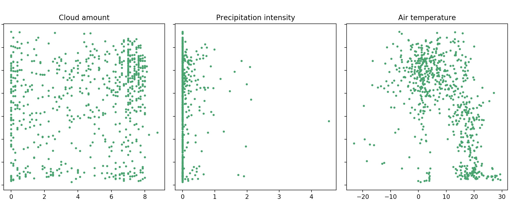
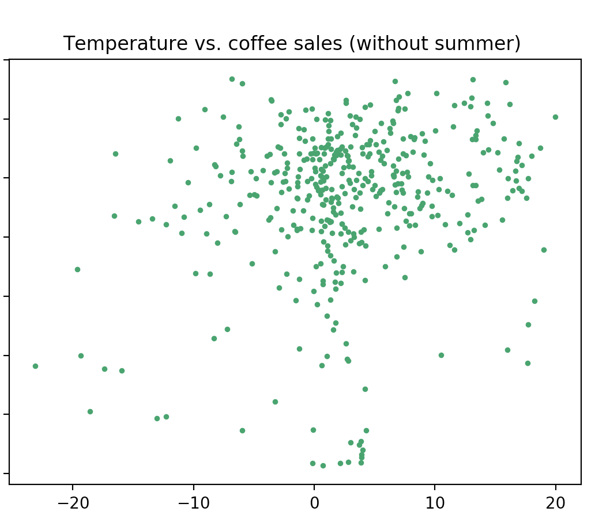
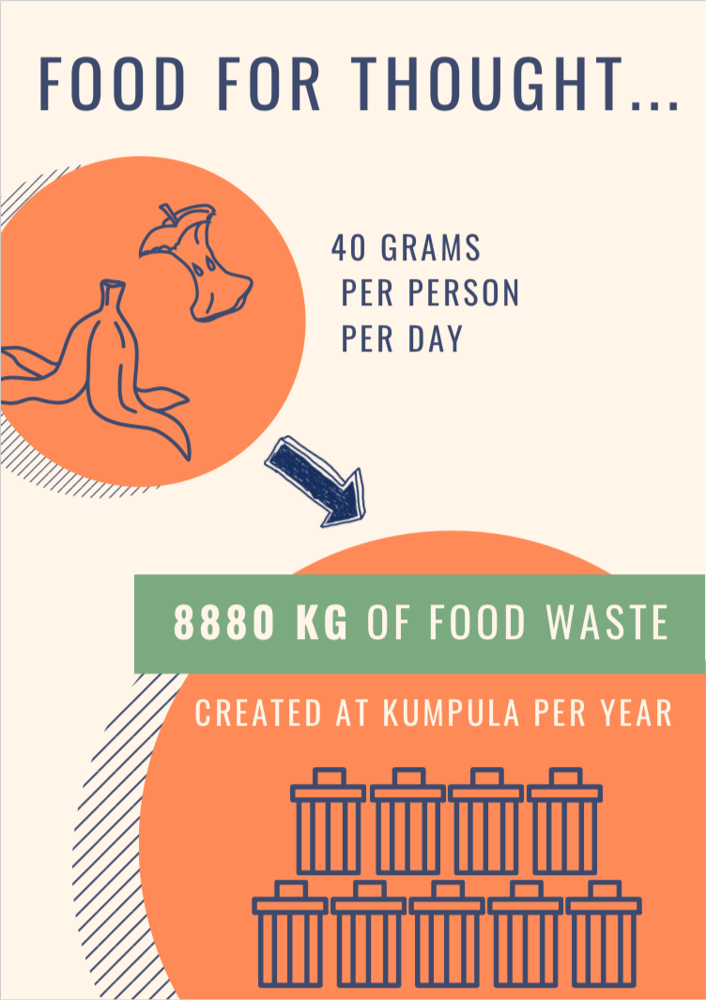
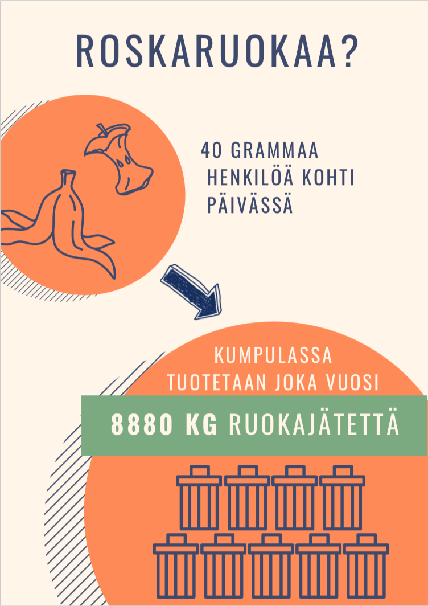
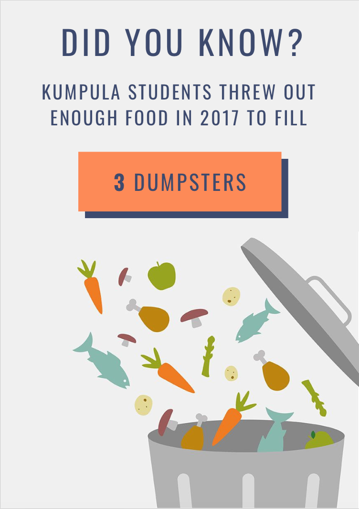
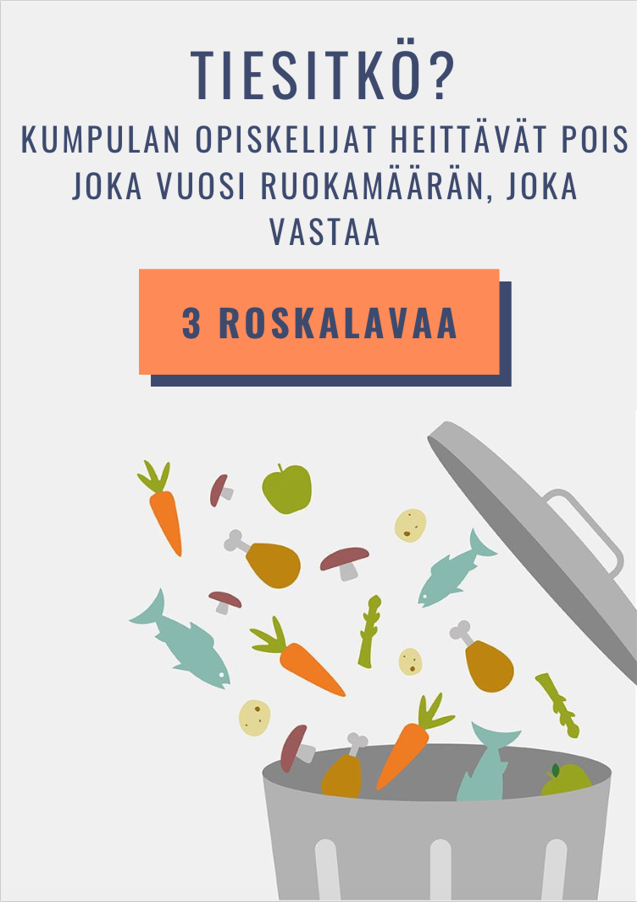

## Welcome to UniCafe Data Analysis

UniCafe is the largest provider of meals to students at the University of Helsinki, serving hundreds of thousands of meals per year.

Here we'll be diving into some of their data!

### Coffee Sales vs. Weather

We wanted to see if we could find a correlation between coffee sales and weather. The premise was that weather could potentially affect people's inclination to drink coffee.

UniCafe was kind enough to give their Kumpula coffee sales data from 4.1.2016 to 21.9.2018. They asked us not to disclose the numbers publicly because the data is business-sensitive which is why we have omitted the actual values in the plot and only show trends.

We downloaded a weather dataset measured <strong>in Kumpula</strong> from the <a href='https://en.ilmatieteenlaitos.fi/download-observations#!/'>Finnish Meteorological Institute</a>.

The data contained hourly measurements, from which we extracted hours between 8-16 and averaged those to obtain a value that would best capture the weather during the time of the day when UniCafe sells coffee.

The weather analysis was based on three variables:
- Cloud amount (okta)
- Precitation intensity (mm/h)
- Air temperature (Celcius degrees)

Here are scatter plots from all three metrics. Y axis shows the <strong> number of sold coffees  in Kumpula </strong>.

#### Cloud amount
The metric does not show any significant correlation even though at first glance there seems to be some accumulation in the top right corner. However, this is likely due to the okta unit used in plot. It ranges from 0 (sky completely clear) to 8 (sky completely cloudy). Due to maximum value 8, value 8 is likely to be overrepresented (as completely cloudy sky will always have value 8).

#### Precipitation intensity
Precipitation intensity represents rainfall. Unfortunately this plot doesn't indicate any interesting findings either.

#### Air temperature
At first, air temperature gave us hope! After all, it is always nice to report actual findings. It looks like there might be some downward trend in the scatter plot. Could this indicate that when the temperature rises, people are less likely to drink coffee?

Well, not really. If you really drill into the reason behind it, it looks like that it's more about the <em>university summer break</em> than anything else. Our Kumpula coffee sales data is heavily skewed: when the temperature rises, less and less people come to the campus and therefore are not buying coffee.

Here is the same plot <strong>without summer months</strong> (May, June, July, August). By looking at it, the trend doesn't appear to be there anymore.

#### Conclusion

Even though we couldn't really see a correlation between coffee sales and weather, it could still exist. It would be interesting to look at this phenomenon with a bigger dataset to see if a trend is there (even if small). Due to the university summer break our data turned out to be not the fit researching this question because different months don't really compare.

### Food Waste
The average customer disposes 40g of biowaste per meal. This may not sound like a lot, but keep in mind that this number is multiplied by the hundreds of thousands of meals served per year! This is perfectly good food heading to the trash, which is bad for the environment and bad for UniCafe's business.

We wanted to draw attention to this problem which we think most youth overlook. What better way than an ad campaign? 

 

By drawing on UniCafe's food waste data, we created posters to visualize and hopefully inspire an emotional response in the people who view this poster (which we believe would be best placed before people serve themselves food).

 

### Customer Feedback
